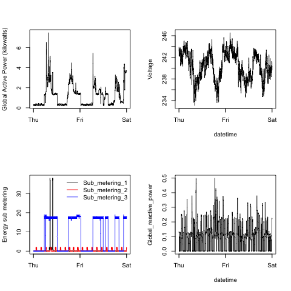

## Introduction

These R scripts process data from the <a href="http://archive.ics.uci.edu/ml/">UC Irvine Machine Learning Repository</a> "Individual household electric power consumption Data Set":

* <b>Dataset</b>: <a href="https://d396qusza40orc.cloudfront.net/exdata%2Fdata%2Fhousehold_power_consumption.zip">Electric power consumption</a> [20Mb]

* <b>Description</b>: Measurements of electric power consumption in one household with a one-minute sampling rate over a period of almost 4 years. Different electrical quantities and some sub-metering values are available.

The following descriptions of the 9 variables in the dataset are taken from the <a href="https://archive.ics.uci.edu/ml/datasets/Individual+household+electric+power+consumption">UCI web site</a>:

<ol>
<li><b>Date</b>: Date in format dd/mm/yyyy </li>
<li><b>Time</b>: time in format hh:mm:ss </li>
<li><b>Global_active_power</b>: household global minute-averaged active power (in kilowatt) </li>
<li><b>Global_reactive_power</b>: household global minute-averaged reactive power (in kilowatt) </li>
<li><b>Voltage</b>: minute-averaged voltage (in volt) </li>
<li><b>Global_intensity</b>: household global minute-averaged current intensity (in ampere) </li>
<li><b>Sub_metering_1</b>: energy sub-metering No. 1 (in watt-hour of active energy). It corresponds to the kitchen, containing mainly a dishwasher, an oven and a microwave (hot plates are not electric but gas powered). </li>
<li><b>Sub_metering_2</b>: energy sub-metering No. 2 (in watt-hour of active energy). It corresponds to the laundry room, containing a washing-machine, a tumble-drier, a refrigerator and a light. </li>
<li><b>Sub_metering_3</b>: energy sub-metering No. 3 (in watt-hour of active energy). It corresponds to an electric water-heater and an air-conditioner.</li>
</ol>

## 4 R Scripts

The repository contains 4 R scripts that create four different plots using the individual household electric power consumption dataset.

If you have not already downloaded and unzipped the dataset to your working directory, each script will attempt to do so and then prepare the data for plotting.

### plot1.R
It creates a histogram plot reflecting the __global active power__ variable distribution.

### plot2.R
It plots a line reflecting changes in __global active power__ over time.

### plot3.R
It plots three lines reflecting changes in __energy sub-metering__ over time.

### plot4.R
It creates 4 plots reflecting changes in __global active power__, __voltage__, __energy sub-metering__, and __global reactive power__ over time.

## Plots

The four plots the R scripts construct are shown below. 

### Plot 1

 

### Plot 2

 

### Plot 3

 

### Plot 4

 

